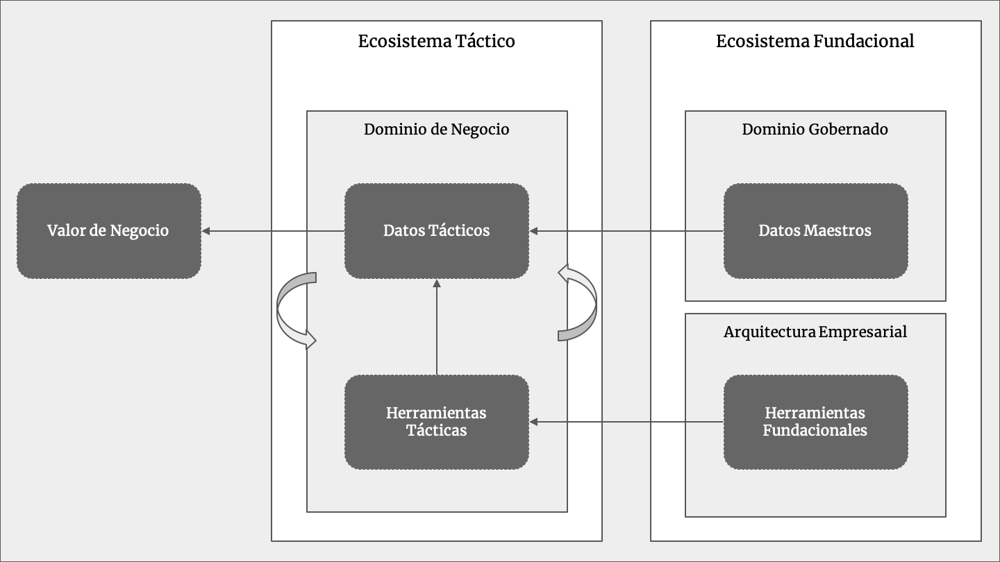

# 4. Estrategia Táctico-Fundacional

La estrategia táctico-fundacional corresponde a una heurística para afrontar problemáticas tecnológicas y de entendimiento en la ejecución de casos de negocio. Se denomina táctico fundacional por la existencia de equipos de pioneros, así como fundadores y planificadores completamente diferenciados. Esta estrategia está destinada a ser un catalizador, principalmente en estrategias ofensivas, las cuales, con base en la realidad de Latinoamérica, concentran la mayoría de los grandes proyectos de modernización de análisis de datos. Esta estrategia se soporta sobre dos grandes equipos: uno con orientación a proyectos y el segundo con orientación a tecnología. En este último hay dos grandes vasos comunicantes: los equipos de gobernanza y los equipos de análisis de negocio. 

A grandes rasgos el esquema estratégico sigue la figura 4, en el que ambos equipos o roles funcionales se retroalimentan en función de los objetivos de negocio. Se distinguen funcionalmente tres grandes dominios, los cuales se clarifican antes de desglosar los roles o funciones que laboran en cada uno de los contextos.

*Figura 4. Esquema táctico-fundacional.*

* Ecosistema táctico: corresponde a la traducción inmediata entre valor de negocio y activos de datos, todas las construcciones están orientadas en la evaluación priorizada de hipótesis de datos que puedan tener un impacto positivo en un KPI concreto de la compañía. Por ejemplo, si se trabaja con metodologías ágiles, corresponde considerar una historia de usuario basada en beneficios concretos y no en activos de información, datos, reportes o modelos de aprendizaje automático. Esto quiere decir que no necesariamente se pesa la complejidad de la solución en esta etapa, sino más bien se itera progresivamente en aprender sobre el problema y encontrar las palancas concretas para resolverlo. En esta etapa existe mucha interacción entre el estado del arte para los problemas y la correcta traducción a la realidad empresa. Los elementos mínimos para generar valor desde el punto de vista táctico, son los datos y herramientas para manipularlos.

    * Data táctica: corresponde a esquemas de información en fases de exploración. Pueden contener variadas fuentes de información en el sentido de volumen, velocidad y variedad. Se utilizan principalmente integraciones rápidas, privilegiando el acceso ante la robustez. En esta etapa táctica es necesario determinar el valor de la fuente de información para priorizar el desarrollo de las integraciones sistémicas, documentación y cualquier otro tipo de esfuerzo técnico o regulatorio para acceder a esta información.

    * Herramientas tácticas: en esta etapa se privilegian las tecnologías de autoatención, así como las herramientas que no requieran fases extensas de desarrollo. El sentido de estas herramientas es simplificar las integraciones y no incurrir en gastos extensos sin antes justificar el valor de la conexión entre los sistemas y los prototipos funcionales.

* Ecosistema Fundacional: el ecosistema fundacional es el principal soporte a mediano y largo plazo para los activos de datos. Priorizados por los equipos tácticos, se logra que las tecnologías se construyan en función al valor y no como innovaciones sin sentido práctico. Este enfoque asegura que los datos por su parte consideren la creación de consolidaciones parciales y depuración de las principales fuentes de datos que requieran los proyectos, con el fin de disminuir la cantidad de errores, funciones operativas y problemas de gestión de conocimiento para el área. En este enfoque, además de los elementos mínimos para encarar las problemáticas, se debe velar por la mantenibilidad de las soluciones, así, tanto los datos como las herramientas deben soportar algún nivel de evolución y sostenibilidad para múltiples proyectos y áreas:

    * Datos maestros: la información ideal para explotar tiene como característica la resiliencia, robustez, y aseguramiento de calidad, regulación y trazabilidad. Como en muchas organizaciones estas máximas no se encuentran aseguradas, en la estrategia táctico-fundacional, los datos maestros se construyen priorizados en función a los proyectos estratégicos.

    * Herramientas fundacionales: contienen características de robustez, escalabilidad, sinergias, ahorros de costo e integraciones sistémicas que consideran un programa de evolución orgánica, en el que se aseguren las características en la medida en que soportan las funcionalidades de las herramientas tácticas priorizadas por los casos de uso. Existen varias formas de priorizar las herramientas fundacionales, desde las recomendaciones del mundo de arquitectura corporativa a los desarrollos incrementales de ingeniería de software. Es importante destacar que el valor de las herramientas fundacionales tiene sentido en el mediano plazo, por ende la elección de tecnologías y su estrategia tendrá su apartado particular en el capítulo siete.
