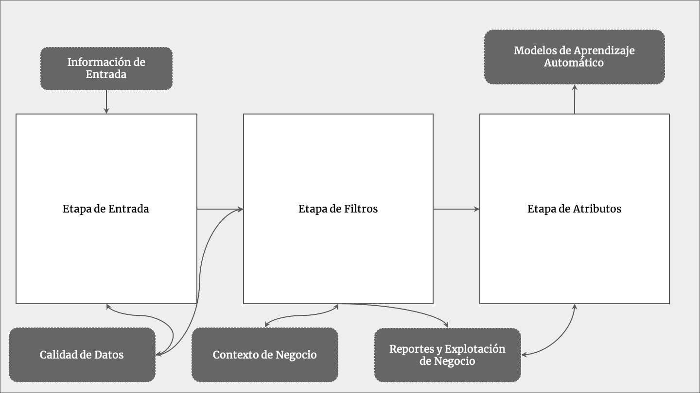

## 8.1.	Calidad de datos

Como vimos en la sección de gobierno de datos, la calidad desde los sistemas, así como la calidad del conocimiento de negocio son problemas persistentes y diseminados a través de la organización. La calidad de las soluciones está estrechamente vinculada a la calidad de los insumos en las “suposiciones” de transformación. Se asumen suposiciones y no verdades en el sentido que la calidad de datos en las empresas no existe, dada la complejidad observada en la gestión de conocimiento, las métricas de calidad, completitud, correctitud, deben ser variables y para no incurrir en problemas de mantenibilidad, es necesario construir “filtros” con estas reglas antes de utilizar la información. Puede parecer un sobreproceso, pero las siguientes recomendaciones, en el mediano plazo, disminuirán tiempo de reprocesamiento, posibilidad de errores, así como la transparencia de las reglas asumidas por los equipos que explotan los datos.

*Figura 12. Principales herramientas dentro de las diferentes componentes tecnológicas y su priorización de desarrollo interno (diferenciación).*

Desacople de transformaciones orientado a la calidad: como se observa en la figura 12, las transformaciones de los datos pueden orientarse en tres grupos, en donde cada uno posee un fin para su estructura. Existen múltiples mecanismos en la literatura para transformar datos, este se recomienda en contextos empresariales, en donde no existe un buen nivel de documentación o las reglas de datos son variables en el tiempo. Cada etapa tiene sus consideraciones de calidad de datos, la cual está contenida en su estructura y es consecuencia y requerimiento mandatorio para su construcción. Fuera de las transformaciones está la información de entrada, los inputs corresponden a la manipulación estándar de la información de entrada -entiéndase por manipulación estándar a todo procedimiento que tiene como fin estandarizar el formato de la información, es decir, transformaciones sintácticas que no alteran el conocimiento, pero si optimizan su manipulación futura y homologación del sistema y sus métricas. 

La siguiente etapa contiene los filtros, los cuales tienen en su estructura un subconjunto del input, el cual tiene contexto y calidad en su estructura, dominio definido y estandarización semántica, o sea que esta etapa se puede considerar como la resiliencia ante cambios y como única capa de explotación válida para las siguientes etapas. Esta consideración vuelve al activo “filtro” el más relevante para realizar calidad de contexto de negocio y construcción mantenible de información. Los atributos por otra parte se consideran construcciones orientadas al análisis, capas de explotación o capas semánticas, el sentido de los atributos es mantener el conocimiento de negocio. 
